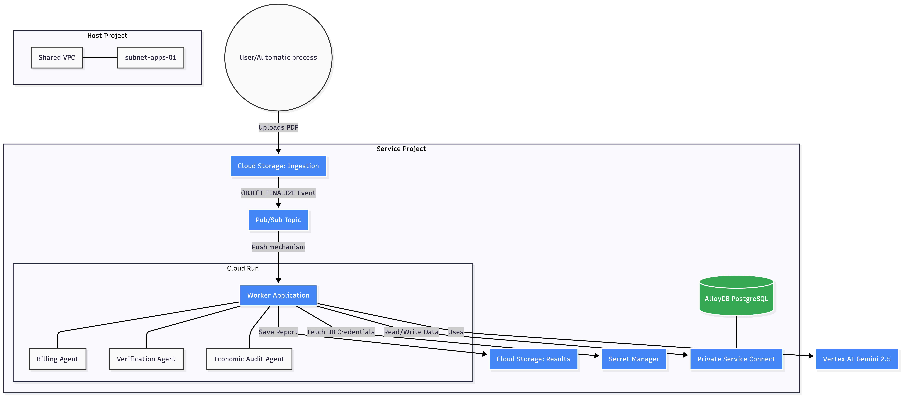
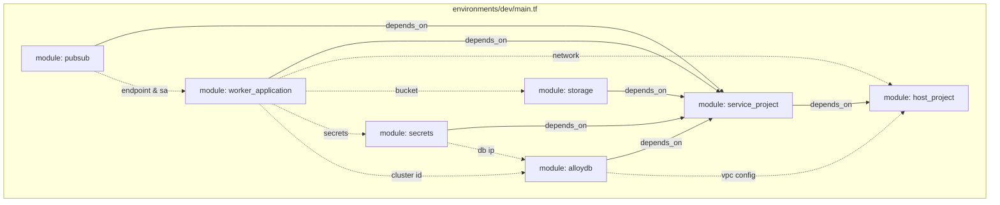

# Swiss Auditor 🏥

**AI-Powered Medical Insurance Audit System**

Swiss Auditor is a Multi-Agent System (MAS) designed to automate the auditing of medical insurance claims. It uses Generative AI (Google Gemini 2.5) to cross-reference invoices with clinical history, identifying discrepancies, overbilling, and verification issues.

## 🏗️ Architecture Diagram

## 🧩 Terraform Modules (Dev Environment)

## 📚 Documentation

Detailed documentation on the system architecture, code structure, and design decisions can be found here:
*   **[Architecture & Design Guide](docs/architecture_and_design.md)**
*   **[Deployment Guide](docs/deployment_guide.md)** - Permissions, secrets, and setup.

## 🚀 Key Features

*   **Automated Auditing**: Replaces manual review with AI agents that read PDFs and extract structured data.
*   **Key Features Enrichment**:
    *   **Parametric File Identification**: Uses provider-specific rules in AlloyDB to identify invoices accurately.
    *   **Administration Date Tracking**: Extracts when drugs were administered from clinical records.
*   **Multi-Agent Pipeline**:
    *   **Billing Agent**: Extracts invoice data from PDFs.
    *   **Matching Agent**: Matches extracted medications against a reference Drug Graph to verify equivalent generic names.
    *   **Verification Agent**: Checks clinical evidence in history records.
    *   **Economic Audit Agent**: Detects financial discrepancies between billed and administered items.
    *   **Consolidation Agent**: Synthesizes results into a formal report in Spanish.
*   **Scalable Infrastructure**: Built on Google Cloud Run, Pub/Sub, and AlloyDB.

## 🕵️‍♂️ Investigation Agent (Gemini Enterprise)

The system includes an independent **Investigation Agent** (located in `gemini-enterprise/`) designed to assist human auditors in querying case data.

*   **Purpose**: Allows natural language queries over investigation documents and metrics.
*   **Capabilities**:
    *   Lists and reads files from GCS for a specific investigation ID.
    *   Queries AlloyDB for metrics and discrepancies.
    *   Exposed via **Gemini Enterprise** and a Custom UI.

## ⚙️ Key Technical Decisions

To ensure robustness and efficiency, the following design decisions were implemented:

*   **Session Isolation**: Each agent step runs in an isolated session (`InMemorySessionService`) to prevent "hallucination drift" from previous steps.
*   **Asynchronous Background Processing**: The Cloud Run worker processes heavy PDF tasks in a background thread to avoid HTTP timeouts.
*   **Automatic PDF Chunking**: PDFs larger than 200 pages are automatically split to respect model context limits and reduce latency.
*   **Rate Limit Resilience**: Custom backoff logic handles 429 Rate Limit errors gracefully.

## 🛠️ Project Structure

*   `agents/`: Source code for AI agents (Billing, Matching, Verification, Audit, Consolidation).
*   `gemini-enterprise/`: Source code for the Investigation Agent (Gemini Enterprise).
*   `worker_service.py`: Main Cloud Run entry point.
*   `dispatch_jobs.py`: Batch job dispatcher.
*   `run_batch_gcs.py`: Core processing logic.
*   `schema.sql`: AlloyDB database schema.

## 🏃‍♂️ Quick Start

### Prerequisites
*   Google Cloud Project with Vertex AI enabled.
*   PostgreSQL (AlloyDB) instance.
*   Python 3.10+

### Deployment
The project includes a `cloudbuild.yaml` for automated deployment to Google Cloud Run.
